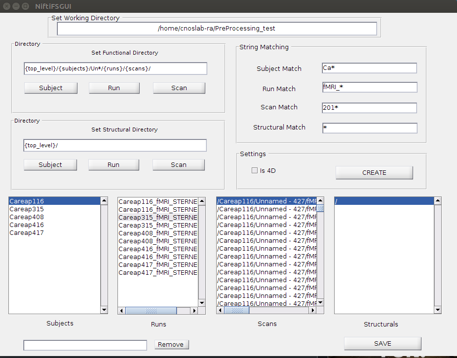

# NiftiFS

##### Ryan Lim

### Introduction
NiftiFS is a simple class meant to add a layer of abstraction to a regular filesystem. The goals are: 
1. To make it simpler and easier to run functions on scans
2. To create a more systematic approach to preprocessing/data cleaning
3. To make a reproducible and stable system of analysis
4. To facilitate the modularity of the system as well as the ability to parallelize certain functions

Overall, the goal is to not have to deal with the filesystem at all, and to instead structure the data more strictly. Doing this allows us to make assumptions about our data, and makes it easier to run analyses.

## Command Line


```python
%% example

fs = NiftiFS(pwd);
set_functional_dirstruct(fs, '{top_level}/{subjects}/{runs}/{scans}');
set_subject_strmatch(fs, 's*');
set_scan_strmatch(fs, 'f*.img');
set_subjects(fs);
set_runs(fs);
fs.summary

```

    UsageError: Cell magic `%%` not found.


The first line "fs = NiftiFS(pwd)" sets the current working path as the top level directory. The top level directory encompasses all functional scans. Structural scans may be kept within this folder, or may be left outside. Because of some weirdness in the past with relative pathing in Matlab, it's recommended that this is an absolute path. fs is the filesystem object. This contains all the relevant variables. 

The set_functional_dirstruct function gives an outline of the structure of the directory. All must start with the {top_level} then follow with {subjects} or {groups}, etc. If there are folders within the structure that aren't relevant to the experiment, they can just be named with or without a wildcard, eg. ('{top_level}/{subjects}/Structural/PUSAG\*/{scans}'). Note that {subjects}, {groups}, {runs}, {scans} are all pluralized. Also note that while there doesn't need to be a strict structure, all elements must at least exist at the same level of subdirectory. 

The strmatch functions find all files or folders which match a given string. For example, if all subjects start with s, the subject_strmatch will be set_subject_strmatch(fs, 's\*'); This will be the same for all runs/groups, etc. If this isn't set, the default is '\*', which simply selects all folders. 

Set functions simply set the relevant variables. 

The get_subj_scans(fs) function is run once all variables are set and accurate, i.e. if fs.subjects contains all subjects, and fs.runs contains all runs. The function returns a struct which contains the subjects, the scans associated with the subjects, as well as the runs and the scans associated with those. If there are no runs this field will be empty. Finally, there are several examples of runners which will run each scan or all scans for a particular subject. 


## GUI 

I also created a simple GUI to go with the program. It works pretty much the same way as the command line, but it's a bit easier to see. 



The top level of your experiment should be in the "Set Working Directory" box. To set the scans/subjects/runs, look at the structure of your directory. For example, my directory had Preprocessing_test/(Careap subjects)/(Unnnamed - #)/(fMRI_Sternberg_Run_#)/(Scans). Therefore, Preprocessing_test was my top level directory, followed by a subject directory, an extra directory (Un*), the runs, and finally the scans. I put these settings in my functional directory, and matched the names on the right. If these are the only folders, you do not need to match them, but for example you have an extra directory Logs, with the subjects, putting Ca* in the subject match field will make sure the only directories matched begin with 'Ca'. Then click create. Save will save the file as "niftifs.mat"
